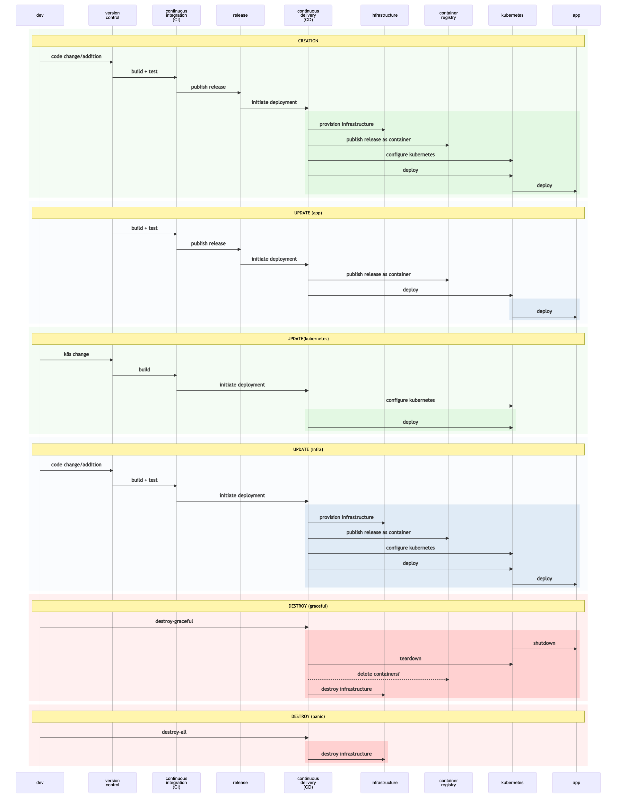
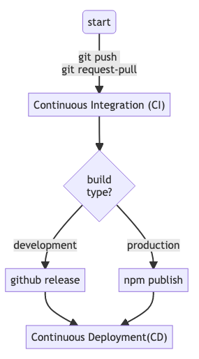
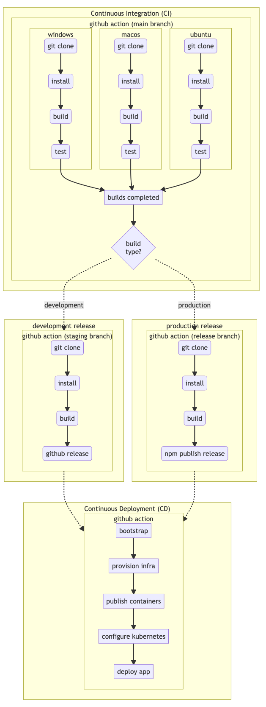

## Background

This document is targeted at engineers who might be very competent and senior, but are new to the dev-ops landscape, Azure, and Kubernetes. While it is not meant to be a comprehensive tutorial, in a crunch, it should provide enough structure and/or pointers to external resources that will allow you to "get things done" and fill in the blanks later.

### B.1 Cattle Not Pets

A requirement of modern reliable systems is quick recovery from any kind of failure. A recurring meme around this notion is to treat infrastructure and indeed any part of the application itself as ["cattle not pets"](http://cloudscaling.com/blog/cloud-computing/the-history-of-pets-vs-cattle/)

> In the old way of doing things, we treat our servers like pets, for example Bob the mail server. If Bob goes down, it’s all hands on deck. The CEO can’t get his email and it’s the end of the world. In the new way, servers are numbered, like cattle in a herd. For example, www001 to www100. When one server goes down, it’s taken out back, shot, and replaced on the line.

### B.2 Azure Management Scope

When working with Azure, it's important understand how Azure organizes the infrastructure for management, billing and security purposes. While complex setups are probably an overkill here,
it is good to have a bare minimum of understanding, so we'll know where to go look when our needs grow.

This illustrates the basic structure of Azure's management hierarchy.

- _Management groups_: These groups are containers that help you manage access, policy, and compliance for multiple subscriptions. All subscriptions in a management group automatically inherit the conditions applied to the management group.
- _Subscriptions_: A subscription logically associates user accounts and the resources that were created by those user accounts. Each subscription has limits or quotas on the amount of resources you can create and use. Organizations can use subscriptions to manage costs and the resources that are created by users, teams, or projects.
- _Resource groups_: A resource group is a logical container into which Azure resources like web apps, databases, and storage accounts are deployed and managed.
- _Resources_: Resources are instances of services that you create, like virtual machines, storage, or SQL databases.

In the remainder of this exercise, we will assume that your "Azure login" is bound to a "subscription" with sufficient privileges, and will work creating `resource-groups` and `resources`.

> It's possible that our `yarn install` has completed by this point. Jump ahead to [#]().
> We'll refer you back to this section before it becomes necessary.

### B.3 Kubernetes

Azure provides a [quick introduction to Kubernetes](https://azure.microsoft.com/en-us/topic/what-is-kubernetes/). If you are just getting started with kubernetes, this is a great place to get started.

If you are a seasoned engineer but new to Kubernetes, [Kubernetes Best Practices](https://www.youtube.com/watch?v=wGz_cbtCiEA&list=PLIivdWyY5sqL3xfXz5xJvwzFW_tlQB_GB) the playlist of 7 videos by Sandeep Dinesh from [Google Cloud Tech](https://www.youtube.com/channel/UCJS9pqu9BzkAMNTmzNMNhvg), is excellent. They run a bit over 50 minutes in total, but have
a very high signal to noise ratio. A good investment.

### B.4 Infrastructure as code

[Infrastructure as Code (IaC)](https://docs.microsoft.com/en-us/devops/deliver/what-is-infrastructure-as-code) is the notion of defining infrastructure in a file - typically uderstood to be as a data specification with a bit of embedded logic. Depending on the framework/tooling used, the balance between pure-data and all-code varies. The important part in any case is that the infrastructure is contained in a file and committed to version control.

#### B.4.1 Git-ops/Infrastructure Lifecycle

The general idea is that our applications are traditional 3-tier apps, consisting of a UI, API and DB. We want to deploy the various pieces into a kubernetes cluster, which itself is provisioned over a public cloud (Azure) infrastructure.

The goal is to build Infrastructure as Code (IaC), which allows us to treat as much of the
infrastructure as cattle as possible.

As we shall see in the remainder of this document, a large fraction of the common use-cases, we can accomplish this notion of treating our infrastructure as cattle. What we want really is an ability to create/update/delete/recreate the application and it's necessary infrastructure at will in am automated fashion.

#### B.4.2 GitOps or not to GitOps? That is the question.

We are not yet at the stage of maturity that we can use git-ops in our setup, however,
we cannot escape the general structure of what git-ops mandates. We are just side-stepping
a multitude of additional tools for now. We are re-inventing the wheel here to keep it simple.

The good news is that eventually this will enable an easier path towards a git-ops flow.

We can think of our infrastructure in four layers:

1. Deployed Application - the top layer - the reason we embark on this journey.
2. Configured Infrastructure - the kubernetes layer
3. Provisioned Infrastructure - the services/infrastructure provisioned on the public cloud
4. Bootstrapping script - the script that gets it all going.

Each layer has it's a notion of a life-cycle - especially the operations - Create - Update/Recreate - Delete

Each layers life-cycle operation at a layer typically impacts all layers above it - this is especially true if a delete operation is invoked. However the binding between the layers is
not formalized or explicit in current IaC structures.

This requires our orchestration scripts to maintain this notion of what is possible and
what not. This is done by scripting specific use cases.

Once the infrastructure is created, for the common case of changes to the app-code, we
have the ability to (re)deploy at will. But that is only because we do not make changes to layers 2-4 in the hierarchy described above. If something should change there, it's most likely a destructive recreation of the system.

The rest of this document tries to build the Create & Delete operations for each layer, so
we can provide these in a scripted fashion. While not complete control, it does allow us
to treat our infrastructure as "cattle-not-pets".

The sequence diagram below pulls together the various actors into a single inter-dependent flow
and layers on the various operations.

### B.5 Infrastructure Lifecycle

In each segment, we highlight the portions of the infrastructure that are impacted. 
We do not yet address `roll-back` scenarios.

### B.6 Continuous Integration & Continuous Delivery (CI/CD)
CI and CD are the buzz words of modern software. While some specifics might vary by project, organization or even team, the core principals can be generalized.
This is useful in ensuring all anticipated use-cases are tackled

- A high-level CI/CD flow is presented in the image below

- A detailed breakdown of the various tasks involved

Note that the `github-actions` block is meant to encapsulate which script a particular piece of the workflow run within. The dotted lines represent [github-action triggers](https://docs.github.com/en/actions/reference/events-that-trigger-workflows)

These flows lead us to create 4 different workflow files:
- `CI.yml`
- `release-development.yml`
- `release-production.yml`
- `CD.yml`

These files have to be added to our application
