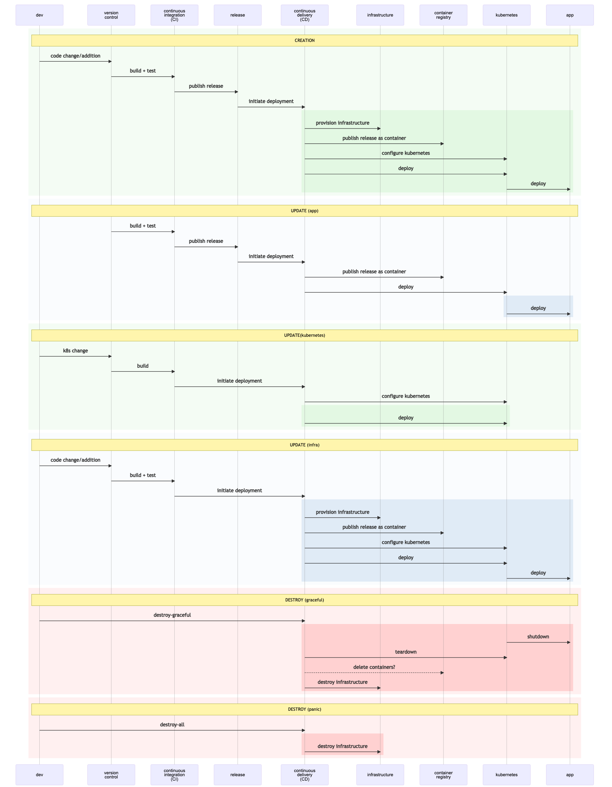
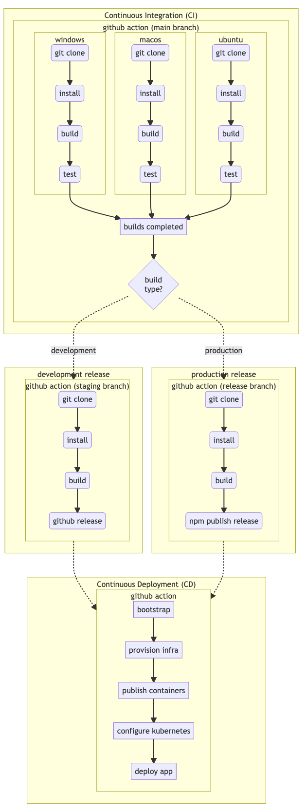

<!-- START doctoc generated TOC please keep comment here to allow auto update -->
<!-- DON'T EDIT THIS SECTION, INSTEAD RE-RUN doctoc TO UPDATE -->

- [Azure Kubernetes DevOps](#azure-kubernetes-devops)
  - [0.1 Pre-requisites](#01-pre-requisites)
  - [0.2 Create the backstage-app](#02-create-the-backstage-app)
    - [Creating the backstage app](#creating-the-backstage-app)
    - [Setup and initialize git repository](#setup-and-initialize-git-repository)
    - [Customize & Adapt the app](#customize--adapt-the-app)
      - [Customizations](#customizations)
      - [Additions](#additions)
    - [0.2.2 Configuring the backstage app](#022-configuring-the-backstage-app)
  - [Background](#background)
    - [B.1 Cattle Not Pets](#b1-cattle-not-pets)
    - [B.2 Azure Management Scope](#b2-azure-management-scope)
    - [B.3 Kubernetes](#b3-kubernetes)
    - [B.4 Infrastructure as code](#b4-infrastructure-as-code)
      - [B.4.1 Git-ops/Infrastructure Lifecycle](#b41-git-opsinfrastructure-lifecycle)
      - [B.4.2 GitOps or not to GitOps? That is the question.](#b42-gitops-or-not-to-gitops-that-is-the-question)
    - [B.5 Infrastructure Lifecycle](#b5-infrastructure-lifecycle)
    - [B.6 Continuous Integration & Continuous Delivery (CI/CD)](#b6-continuous-integration--continuous-delivery-cicd)
  - [Infrastructure Design](#infrastructure-design)
    - [Infrastructure/Configuration inventory](#infrastructureconfiguration-inventory)
    - [Automation](#automation)
  - [1. Lifecycle scripts](#1-lifecycle-scripts)
    - [1.1 Creation](#11-creation)
    - [1.2 Update Application](#12-update-application)
    - [1.3 Destroy](#13-destroy)
  - [2. Support Scripts](#2-support-scripts)
    - [2.1 Globals](#21-globals)
    - [2.2 Bootstrap](#22-bootstrap)
      - [2.2.1 Subscription ID](#221-subscription-id)
      - [2.2.2 Resource Group](#222-resource-group)
      - [2.2.3 Azure Active Directory Application](#223-azure-active-directory-application)
      - [2.2.4 Service Principal](#224-service-principal)
      - [2.2.5 Bootstrap trailer](#225-bootstrap-trailer)
    - [2.3 Infrastructure](#23-infrastructure)
      - [2.3.1 Networking](#231-networking)
      - [2.3.2 Azure Kubernetes Service (AKS)](#232-azure-kubernetes-service-aks)
      - [2.3.3 Azure Container Registry (ACR)](#233-azure-container-registry-acr)
      - [2.3.4 Bind ACR and AKS](#234-bind-acr-and-aks)
      - [2.3.5](#235)
    - [2.4 Build](#24-build)
    - [2.5. Configure Kubernetes](#25-configure-kubernetes)
      - [2.5.1 Create](#251-create)
        - [AKS Credentials and kubectl](#aks-credentials-and-kubectl)
        - [Namespace](#namespace)
          - [Validation](#validation)
      - [2.5.2 Api](#252-api)
        - [2.5.2.1 Deployment](#2521-deployment)
        - [2.5.2.2 Service](#2522-service)
      - [2.5.3 UI](#253-ui)
        - [2.5.3.1 Deployment](#2531-deployment)
        - [2.5.3.2 Service](#2532-service)
      - [2.5.4 Apply and Verify](#254-apply-and-verify)
    - [2.6. Deploy](#26-deploy)
    - [2.7 Destroy](#27-destroy)
      - [AKS (destroy)](#aks-destroy)
      - [Networking (destroy)](#networking-destroy)
      - [Bootstrap (destroy)](#bootstrap-destroy)
    - [2.8 Read](#28-read)
  - [TODO](#todo)
  - [Links/References](#linksreferences)

<!-- END doctoc generated TOC please keep comment here to allow auto update -->

# Azure Kubernetes DevOps

This module documents the various pieces needed to deploy a traditional web app using kubernetes on Azure.

Assumes the app is a traditional 3-tier app:

- front-end: a web client
- back-end: an API service (a nodejs app in this example)
- database: a SQL database server (we presume postgres and that we will use the Azure managed postgres service)

## 0.1 Pre-requisites

Before we can proceed, we will need to ensure the following programs are installed on your system/environment. These are hard to automate reliably
across the various OS', and require you to personally tend to them.

[List of pre-requisites installations](./docs/pre-reqs.md). It's a bit of busy work, but only in aide of making the rest of this exercise smoother. Best of all, we'll wait while you are at it.


Welcome back!

## 0.2 An app to build and deploy
This project was born out of a need to create and deploy a custom [backstage](https://backstage.io) app.

While it is beyond the scope of this document to get into specifics, a [reference implementation](https://github.com/acuity-sr/bkstg-one) provides an app for us to work with here, while also documenting the steps needed to create a backstage app


## Background

This document is targeted at engineers who might be very competent and senior, but are new to the dev-ops landscape, Azure, and Kubernetes. While it is not meant to be a comprehensive tutorial, in a crunch, it should provide enough structure and/or pointers to external resources that will allow you to "get things done" and fill in the blanks later.

### B.1 Cattle Not Pets

A requirement of modern reliable systems is quick recovery from any kind of failure. A recurring meme around this notion is to treat infrastructure and indeed any part of the application itself as ["cattle not pets"](http://cloudscaling.com/blog/cloud-computing/the-history-of-pets-vs-cattle/)

> In the old way of doing things, we treat our servers like pets, for example Bob the mail server. If Bob goes down, it’s all hands on deck. The CEO can’t get his email and it’s the end of the world. In the new way, servers are numbered, like cattle in a herd. For example, www001 to www100. When one server goes down, it’s taken out back, shot, and replaced on the line.

### B.2 Azure Management Scope

When working with Azure, it's important understand how Azure organizes the infrastructure for management, billing and security purposes. While complex setups are probably an overkill here,
it is good to have a bare minimum of understanding, so we'll know where to go look when our needs grow.

[](https://docs.microsoft.com/en-us/azure/cloud-adoption-framework/ready/azure-setup-guide/organize-resources?tabs=AzureManagementGroupsAndHierarchy)

This illustrates the basic structure of Azure's management hierarchy.

- _Management groups_: These groups are containers that help you manage access, policy, and compliance for multiple subscriptions. All subscriptions in a management group automatically inherit the conditions applied to the management group.
- _Subscriptions_: A subscription logically associates user accounts and the resources that were created by those user accounts. Each subscription has limits or quotas on the amount of resources you can create and use. Organizations can use subscriptions to manage costs and the resources that are created by users, teams, or projects.
- _Resource groups_: A resource group is a logical container into which Azure resources like web apps, databases, and storage accounts are deployed and managed.
- _Resources_: Resources are instances of services that you create, like virtual machines, storage, or SQL databases.

In the remainder of this exercise, we will assume that your "Azure login" is bound to a "subscription" with sufficient privileges, and will work creating `resource-groups` and `resources`.

> It's possible that our `yarn install` has completed by this point. Jump ahead to [#]().
> We'll refer you back to this section before it becomes necessary.

### B.3 Kubernetes

Azure provides a [quick introduction to Kubernetes](https://azure.microsoft.com/en-us/topic/what-is-kubernetes/). If you are just getting started with kubernetes, this is a great place to get started.

If you are a seasoned engineer but new to Kubernetes, [Kubernetes Best Practices](https://www.youtube.com/watch?v=wGz_cbtCiEA&list=PLIivdWyY5sqL3xfXz5xJvwzFW_tlQB_GB) the playlist of 7 videos by Sandeep Dinesh from [Google Cloud Tech](https://www.youtube.com/channel/UCJS9pqu9BzkAMNTmzNMNhvg), is excellent. They run a bit over 50 minutes in total, but have
a very high signal to noise ratio. A good investment.

### B.4 Infrastructure as code

[Infrastructure as Code (IaC)](https://docs.microsoft.com/en-us/devops/deliver/what-is-infrastructure-as-code) is the notion of defining infrastructure in a file - typically uderstood to be as a data specification with a bit of embedded logic. Depending on the framework/tooling used, the balance between pure-data and all-code varies. The important part in any case is that the infrastructure is contained in a file and committed to version control.

#### B.4.1 Git-ops/Infrastructure Lifecycle

The general idea is that our applications are traditional 3-tier apps, consisting of a UI, API and DB. We want to deploy the various pieces into a kubernetes cluster, which itself is provisioned over a public cloud (Azure) infrastructure.

The goal is to build Infrastructure as Code (IaC), which allows us to treat as much of the
infrastructure as cattle as possible.

As we shall see in the remainder of this document, a large fraction of the common use-cases, we can accomplish this notion of treating our infrastructure as cattle. What we want really is an ability to create/update/delete/recreate the application and it's necessary infrastructure at will in am automated fashion.

#### B.4.2 GitOps or not to GitOps? That is the question.

We are not yet at the stage of maturity that we can use git-ops in our setup, however,
we cannot escape the general structure of what git-ops mandates. We are just side-stepping
a multitude of additional tools for now. We are re-inventing the wheel here to keep it simple.

The good news is that eventually this will enable an easier path towards a git-ops flow.

We can think of our infrastructure in four layers:

1. Deployed Application - the top layer - the reason we embark on this journey.
2. Configured Infrastructure - the kubernetes layer
3. Provisioned Infrastructure - the services/infrastructure provisioned on the public cloud
4. Bootstrapping script - the script that gets it all going.

Each layer has it's a notion of a life-cycle - especially the operations - Create - Update/Recreate - Delete

Each layers life-cycle operation at a layer typically impacts all layers above it - this is especially true if a delete operation is invoked. However the binding between the layers is
not formalized or explicit in current IaC structures.

This requires our orchestration scripts to maintain this notion of what is possible and
what not. This is done by scripting specific use cases.

Once the infrastructure is created, for the common case of changes to the app-code, we
have the ability to (re)deploy at will. But that is only because we do not make changes to layers 2-4 in the hierarchy described above. If something should change there, it's most likely a destructive recreation of the system.

The rest of this document tries to build the Create & Delete operations for each layer, so
we can provide these in a scripted fashion. While not complete control, it does allow us
to treat our infrastructure as "cattle-not-pets".

The sequence diagram below pulls together the various actors into a single inter-dependent flow
and layers on the various operations.

### B.5 Infrastructure Lifecycle



In each segment, we highlight the portions of the infrastructure that are impacted. 
We do not yet address `roll-back` scenarios.


### B.6 Continuous Integration & Continuous Delivery (CI/CD)
CI and CD are the buzz words of modern software. While some specifics might vary by project, organization or even team, the core principals can be generalized.
This is useful in ensuring all anticipated use-cases are tackled

- A high-level CI/CD flow is presented in the image below


- A detailed breakdown of the various tasks involved



Note that the `github-actions` block is meant to encapsulate which script a particular piece of the workflow run within. The dotted lines represent [github-action triggers](https://docs.github.com/en/actions/reference/events-that-trigger-workflows)

These flows lead us to create 4 different workflow files:
- `CI.yml`
- `release-development.yml`
- `release-production.yml`
- `CD.yml`

These files have to be added to our application

## Infrastructure Design

We now have an application to deploy, and a basic requirement that we are going to deploy
the application over a kubernetes cluster on the Azure cloud. We also have a basic understanding of a concepts and pieces involved.

So with that, let's get started.

We will be adapting the [AKS workshop architecture](https://docs.microsoft.com/en-us/learn/modules/aks-workshop/01-introduction) to fit our needs. Specifically, there are two changes we anticipate

1. replacing `mongo-db` within the kubernetes cluster with an _Azure Managed Postgres_ instance
2. [TBD] adding an _Azure Key Vault_ to manage secrets (db credentials mainly)

Instead of building things up one step at a time, we will assume that the architecture works
and build for the final goal. Meaning, our script will not piece-meal the building to aide understanding. Please read/implement the workshop tutorial to gain that understanding.


At some point in the future, we hope to incorporate as much of the security and governance capabilities as appropriate. The [Security and Governance workshop](https://github.com/Azure/sg-aks-workshop) will serve as a starting point for that exercise. The link is only provided here for (future) reference.

### Infrastructure/Configuration inventory

These are the pieces that we'll need to provision/configure as part of our script.
They are also split up by stage of creation, allowing us automate with clear separation
of responsibility.

| Layer     | Azure                   | Kubernetes                  |
| --------- | ----------------------- | --------------------------- |
| bootstrap | resource-group          |                             |
|           | service-principal       |                             |
| infra     | azure-networking        |                             |
|           | AKS-cluster             |                             |
|           | ACR                     |                             |
|           | bind AKS-ACR            |                             |
|           | Azure-postgres          |                             |
|           | log-analytics workspace |                             |
|           | AKS monitoring addon    |                             |
| config    |                         | namespace                   |
|           |                         | api-Deployment              |
|           |                         | api-Service                 |
|           |                         | LoadBalancer                |
|           |                         | ui-Deployment               |
|           |                         | ui-Service                  |
|           |                         | ingress                     |
|           |                         | cert-manager                |
|           |                         | ClusterRole(monitoring)     |
|           |                         | api-HorizontalPodAutoscaler |

### Automation

As with any automation, the point here is to have an ability to apply the general template being developed here to fit other needs.

Other needs could include deploying

- the same application to different environments (dev/test/production etc)
- the same application to different regions
- and even different applications using the same template

> Further, we will use [`doable`](https://github.com/acuity-sr/doable) to extract these into self contained scripts, making this an executable document!

The [infrastructure lifecyle](#infrastructure-lifecycle) sequence diagram lists the various operations we anticipate needing as part of any reasonable service in the cloud.

To wit, these are the use-cases that are planned on being supported (eventually):

1. **Creation**, developer initiated, provision some/all of the infra, kubernetes and app
2. **Update (application)**, developer initiated, typically the raison d'etre for this tooling
3. **Update (kubernetes)**, developer or ops driven action to better manage load or changing requirements
4. **Update (infrastructure)**, ops driven to manage load, developer driven to adapt architecture
5. **Delete (app)**, end-of-life or migration driven
6. **Delete (kubernetes)**, typically triggered by migration/deletion of underling infrastructure
7. **Delete (infrastructure)**, scaling or migration driven
8. **Destroy**, panic mode teardown of everything - in production should only by triggered under attack - for security or cost reasons. When "stopping-the-pain-right-now" is more important than we need a guarantee that we and isolate the fault. Interestingly, this can also be used in dev (non-production), to tear down infrastructure to minimize idle-time-billing.

> Caution: all delete/destroy operations in production (or with "real customers") will need to be protected from accidental execution. This is currently not addressed as part of this document or implementation. TBD

For a phase 1 implementation, we will

- not provide any protections/safeguards against foot-guns for #3,4,8. Operation caution advised to prevent catastrophic errors
- skip items #4-7

## 1. Lifecycle scripts

We first develop the lifecycle scripts needed to manage the different use cases.

To prevent catastrophic consequences, it's highly recommended that operators understand these scripts well
and invoke them with proper human review.

### 1.1 Creation

Defines the workflow to implement the "Creation" use-case.
The script creates/reuses any necessary resources.

- `windows` (win/create.bat)

```bat win/create.bat

rem command line parameters
set STAGE=%1
set RELEASE=%2

rem initialize script dir (via https://stackoverflow.com/a/36351656)
pushd %~dp0
set DEVOPS_SCRIPT_DIR=%CD%
popd

set USE_CASE=create
echo "\n\n================="
echo     " Create Workflow "
echo     "=================\n\n"

call %DEVOPS_SCRIPT_DIR%\pre-reqs.bat
call %DEVOPS_SCRIPT_DIR%\..\globals.bat
call %DEVOPS_SCRIPT_DIR%\support\bootstrap.bat
call %DEVOPS_SCRIPT_DIR%\support\app_build.bat
call %DEVOPS_SCRIPT_DIR%\support\create_infra.bat
call %DEVOPS_SCRIPT_DIR%\support\create_kubernetes.bat
call %DEVOPS_SCRIPT_DIR%\app_deploy.bat
rem call %DEVOPS_SCRIPT_DIR%\support\destroy_all.bat

```

- `*nix` (nix/create.sh)

```sh nix/create.sh

# command line parameters
STAGE=${1}
RELEASE=${2}

DEVOPS_SCRIPT_DIR="$( cd "$( dirname "${BASH_SOURCE[0]}" )" &> /dev/null && pwd )"

USE_CASE=create
echo "\n\n================="
echo     " Create Workflow "
echo     "=================\n\n"


. ${DEVOPS_SCRIPT_DIR}/pre-reqs.sh
. ${DEVOPS_SCRIPT_DIR}/../globals.sh
. ${DEVOPS_SCRIPT_DIR}/support/bootstrap.sh
. ${DEVOPS_SCRIPT_DIR}/support/app_build.sh
. ${DEVOPS_SCRIPT_DIR}/support/create_infra.sh
# . ${DEVOPS_SCRIPT_DIR}/support/create_kubernetes.sh
# . ${DEVOPS_SCRIPT_DIR}/app_deploy.sh
# . ${DEVOPS_SCRIPT_DIR}/support/destroy_all.sh

```

### 1.2 Update Application

Updates the "application"

- `windows` (win/update-app.bat)

```bat win/update-app.bat

rem command line parameters
set STAGE=%1
set RELEASE=%2

rem initialize script dir (via https://stackoverflow.com/a/36351656)
pushd %~dp0
set DEVOPS_SCRIPT_DIR=%CD%
popd

set USE_CASE=update-app
echo "\n\n================="
echo     " Update Workflow "
echo     "=================\n\n"

call %DEVOPS_SCRIPT_DIR%\pre-reqs.bat
call %DEVOPS_SCRIPT_DIR%\..\globals.bat
call %DEVOPS_SCRIPT_DIR%\support\bootstrap.bat
call %DEVOPS_SCRIPT_DIR%\support\app_build.bat
rem call %DEVOPS_SCRIPT_DIR%\support\create_infra.bat
rem call %DEVOPS_SCRIPT_DIR%\support\create_kubernetes.bat
call %DEVOPS_SCRIPT_DIR%\app_deploy.bat
rem call %DEVOPS_SCRIPT_DIR%\support\destroy_all.bat

```

- `*nix` (nix/update-app.sh)

```sh nix/update-app.sh

# command line parameters
STAGE=${1}
RELEASE=${2}

DEVOPS_SCRIPT_DIR="$( cd "$( dirname "${BASH_SOURCE[0]}" )" &> /dev/null && pwd )"

set USE_CASE=update-app
echo "\n\n================="
echo     " Update Workflow "
echo     "=================\n\n"

. ${DEVOPS_SCRIPT_DIR}/pre-reqs.sh
. ${DEVOPS_SCRIPT_DIR}/../globals.sh
. ${DEVOPS_SCRIPT_DIR}/support/bootstrap.sh
. ${DEVOPS_SCRIPT_DIR}/support/app_build.sh
# . ${DEVOPS_SCRIPT_DIR}/support/create_infra.sh
# . ${DEVOPS_SCRIPT_DIR}/support/create_kubernetes.sh
. ${DEVOPS_SCRIPT_DIR}/app_deploy.sh
# . ${DEVOPS_SCRIPT_DIR}/support/destroy_all.sh

```

### 1.3 Destroy

Destroys all provisioned infrastructure, including the "Service Principal" and "App" created during the bootstrap.
This is a kill-switch - meant to be used in development to shut down resources to save idle-billing of cloud resources.

- `windows` (win/destroy.bat)

```bat win/destroy.bat

rem command line parameters
set STAGE=%1
set RELEASE="Don't care"

rem initialize script dir (via https://stackoverflow.com/a/36351656)
pushd %~dp0
set DEVOPS_SCRIPT_DIR=%CD%
popd

set USE_CASE=destroy
echo "\n\n=================="
echo     " Destroy Workflow "
echo     "==================\n\n"


call %DEVOPS_SCRIPT_DIR%\pre-reqs.bat
call %DEVOPS_SCRIPT_DIR%\..\globals.bat
call %DEVOPS_SCRIPT_DIR%\support\bootstrap.bat
rem call %DEVOPS_SCRIPT_DIR%\support\app_build.bat
rem call %DEVOPS_SCRIPT_DIR%\support\create_infra.bat
rem call %DEVOPS_SCRIPT_DIR%\support\create_kubernetes.bat
rem call %DEVOPS_SCRIPT_DIR%\app_deploy.bat
call %DEVOPS_SCRIPT_DIR%\support\destroy_all.bat

```

- `*nix` (nix/destroy.sh)

```sh nix/destroy.sh

# command line parameters
STAGE=${1}
RELEASE="Don't care"

DEVOPS_SCRIPT_DIR="$( cd "$( dirname "${BASH_SOURCE[0]}" )" &> /dev/null && pwd )"

set USE_CASE=destroy
echo "\n\n=================="
echo     " Destroy Workflow "
echo     "==================\n\n"

. ${DEVOPS_SCRIPT_DIR}/pre-reqs.sh
. ${DEVOPS_SCRIPT_DIR}/../globals.sh
. ${DEVOPS_SCRIPT_DIR}/support/bootstrap.sh
# . ${DEVOPS_SCRIPT_DIR}/support/app_build.sh
# . ${DEVOPS_SCRIPT_DIR}/support/create_infra.sh
# . ${DEVOPS_SCRIPT_DIR}/support/create_kubernetes.sh
# . ${DEVOPS_SCRIPT_DIR}/app_deploy.sh
. ${DEVOPS_SCRIPT_DIR}/support/destroy_all.sh

```

## 2. Support Scripts

The support scripts needed to enable the life-cycle scripts of [section 1](#lifecycle-scripts)

### 2.1 Globals

The minimal required configuration that is provided by the owner of the system.
There is only one variable that is assumed to exist external to these scripts

- `windows` (create globals.bat)

```bat globals.bat
rem required - hard coded per repo/project
set GH_ORG=acuity-sr
set GH_REPO=acuity-bkstg

rem also required, but can be set in a calling script,
rem allowing a CD script to customize these if needed.
set /p RELEASE=${RELEASE?}
set /p STAGE=${STAGE:?'dev'}
set /p REGION_NAME=${REGION_NAME:?'eastus'}

rem optional
set SUBSCRIPTION_ID=d8f43804-1ed0-4f0d-b26d-77e8e11e86fd

rem Customize APP_NAME to fit your needs.
rem It's used as a prefix for all resources
rem (even the ResourceGroup) created.
set APP_NAME=%GH_REPO%-%STAGE%-%REGION%
set APP=%GH_REPO%

pushd %~dp0
set SCRIPT_ROOT=%CD%
popd

rem the project src is typically one level up from the dev-ops "scripts" folder.
SRC_DIR=%SCRIPT_ROOT%/..

rem convenience definitions
set RED="[31m [31m"
set GREEN="[32m [32m"
set YELLOW="[33m [33m"
set BLUE="[34m [34m"
set PURPLE="[35m [35m"
set CYAN="[36m [36m"
rem NO_COLOR
set NC="[0m"

rem "generated" globals
```

- `*nix` (create globals.sh)

```sh globals.sh
# required - hard coded per repo/project
GH_ORG=acuity-sr
GH_REPO=acuity-bkstg

# also required, but can be set in a calling script,
# allowing a CD script to customize these if needed.

# RELEASE & STAGE are specified by CD script.
# modify to allow default values if that makes sense.

RELEASE=${RELEASE:?} # error if not specified globally.
STAGE=${STAGE:?}     # error if not specified globally.
REGION_NAME=${REGION_NAME:-'eastus'} # default = 'eastus'

# optional
SUBSCRIPTION_ID=d8f43804-1ed0-4f0d-b26d-77e8e11e86fd

# Customize APP_NAME to fit your needs.
# It's used as a prefix for all resources
# (even the ResourceGroup) created.
APP_NAME=${GH_REPO}-${STAGE}-${REGION_NAME}
APP=${GH_REPO}


# debug controls
set -e # stop on error
# set -x # echo commands, expand variables
# set -v # echo commands, do not expand variables


SCRIPT_ROOT="$( cd "$( dirname "${BASH_SOURCE[0]}" )" &> /dev/null && pwd )"

# the project src is typically one level up from the dev-ops "scripts" folder.
SRC_DIR=${SCRIPT_ROOT}/..

# convenience definitions
RED='\033[0;31m'
GREEN='\033[0;32m'
YELLOW='\033[0;33m'
BLUE='\033[0;34m'
PURPLE='\033[0;35m'
CYAN='\033[0;36m'
# NO_COLOR
NC="\033[0m"

# "generated" globals

```

### 2.2 Bootstrap

The bootstrap script is meant to initialize the Service Principal.

It accesses/creates 3 things -

1. Subscription ID (extracted from the account or specified by the user)
2. Azure Active Directory Application
3. Service Principal

It works in two modes:

1. **Create**: Creates or reuses AD Application, Service Principal and Resource Group.
2. **Others**: Expects to reuse AD Application, Service Principal and Resource Group. Errors if not found.

#### 2.2.1 Subscription ID

As we explored in the section on Azure Management Hierarchies, each Azure deployment is contained within a "subscription". Subscriptions are a logical partition, allowing billing and management control. Creating a subscription is beyond the scope of this document, however, by having a personal login to the Azure cloud, you are working within the purview of a "subscription". At a minimum, it has a clearly defined party to be billed for resources consumed. This could be an employer or your personal credit card used to setup the Azure account.

While we do not create it, we do need the subscription id to create a Resource Group, which will in turn contain all the resources we consume.

The subscription ID can vary by login. While it's possible (even preferable) to hard code this value for a team, when running this script on your local machine, this will likely vary.

The bootstrap script automates it's extraction - after you have logged via the azure CLI.

- `windows` (win/support/bootstrap.bat)

```bat win/support/bootstrap.bat

echo "\n*****************"
echo   "* Bootstrapping *"
echo   "*****************\n\n"

if (%SUBSCRIPTION_ID% == '') (
  echo "Extracting Azure 'Subscription ID' from current login"
  rem Opens a webpage to login to Azure and provides credentials to the azure-cli
  az login

  rem Picks the subscription tied to the login above
  rem az account show --query 'id' --output tsv
  FOR /F "tokens=* USEBACKQ" %%g IN (`az account show --query 'id' --output tsv`) do (SET SUBSCRIPTION_ID=%%g)
)

if (%SUBSCRIPTION_ID% == '') (
  echo "%RED%ERROR: Subscription ID not found%NC%"
  exit /b -1
) else (
  echo "%YELLOW%SUBSCRIPTION_ID:%CYAN% %SUBSCRIPTION_ID% %NC%"
)
```

- `*nix` (nix/support/bootstrap.sh)

```sh nix/support/bootstrap.sh

echo "\n*****************"
echo   "* Bootstrapping *"
echo   "*****************\n\n"

# specify SUBSCRIPTION_ID here if you'd like to pin it to a specific one.
# by default, will ask you to login and use the SUBSCRIPTION_ID tied to your account
if [[ ${SUBSCRIPTION_ID} == '' ]]
then
  echo "Extracting Azure 'Subscription ID' from current login"

  # Opens a webpage to login to Azure and provides credentials to the azure-cli
  az login

  # Picks the subscription tied to the login above
  # az account show --query 'id' --output tsv
  SUBSCRIPTION_ID=$(az account show --query 'id' --output tsv)
fi

SUBSCRIPTION_NAME=$(az account show --subscription ${SUBSCRIPTION_ID} --query 'name')

if [[ ${SUBSCRIPTION_ID} == '' ]]
then
 echo "${RED}ERROR: Subscription ID not found${NC}"
 exit -1
else
 echo "${YELLOW}SUBSCRIPTION_ID:${CYAN} ${SUBSCRIPTION_ID} ${NC}"
 echo "${YELLOW}SUBSCRIPTION_NAME:${CYAN} ${SUBSCRIPTION_NAME} ${NC}"
fi
```

#### 2.2.2 Resource Group

- globals
  Extract resource names into globals.{sh|bat} to allow use in other lifecycle methods

  - `windows` (globals.bat)
    ```bat globals.bat
    set RESOURCE_GROUP=%APP_NAME%-rg
    ```
  - `*nix` (globals.sh)
    ```sh globals.sh
    RESOURCE_GROUP=${APP_NAME}-rg
    ```

- `windows` (win/support/bootstrap.bat)

```bat win/support/bootstrap.bat

set RESOURCE_GROUP=%APP_NAME%-rg

echo "\nResource Group '%RESOURCE_GROUP%'"

FOR /F "tokens=* USEBACKQ" %%g IN (`az group exists -n %RESOURCE_GROUP%`) do (SET rgExists=%%g)


if (%rgExists%=='true') (
  echo "Reusing existing resource group '${RESOURCE_GROUP}'"
) else (
  if (%USE_CASE%=='create') (
    echo "Creating resource-group '%RESOURCE_GROUP%'"
    az group create \
      --name %RESOURCE_GROUP% \
      --location %REGION_NAME%
  ) else (
    echo "%RED% ERROR: Can only create ResourceGroup with USE_CASE=create, not %USE_CASE%%NC%"
    exit /b -1
  )
)
FOR /F "tokens=* USEBACKQ" %%g IN (`az group show --query 'id' -n %RESOURCE_GROUP%`) do (SET RESOURCE_GROUP_ID=%%g)

if (%RESOURCE_GROUP_ID% == '') (
  echo "%RED%ERROR: RESOURCE_GROUP_ID not found%NC%"
  exit /b -1
) else (
  echo "%YELLOW%RESOURCE_GROUP_ID:%CYAN% %RESOURCE_GROUP_ID% %NC%"
)
```

- `*nix` (nix/support/bootstrap.sh)

```sh nix/support/bootstrap.sh

echo "\nResource Group '${RESOURCE_GROUP}'"

rgExists=$(az group exists -n ${RESOURCE_GROUP})

if [[ ${rgExists} == 'true' ]];
then
  echo "Reusing existing resource group '${RESOURCE_GROUP}'"
elif [[ "${USE_CASE}" == "create" ]]
then
  echo "Creating resource-group '${RESOURCE_GROUP}' ${REGION_NAME}"
  # echo "az group create --name ${RESOURCE_GROUP} --location ${REGION_NAME}"
  # trap return value of next command & discard. bash seems to treat it as an error.
  JUNK=$(az group create --name ${RESOURCE_GROUP} --location ${REGION_NAME})
  unset JUNK
else
  echo "${RED} ERROR: Can only create ResourceGroup with USE_CASE=create, not ${USE_CASE}${NC}"
  exit -1
fi


RESOURCE_GROUP_ID=$(az group show --query 'id' -n ${RESOURCE_GROUP} -o tsv)

if [[ ${RESOURCE_GROUP_ID} == '' ]]
then
 echo "${RED}ERROR: RESOURCE_GROUP_ID not found${NC}"
 exit /b -1
else
 echo "${YELLOW}RESOURCE_GROUP_ID:${CYAN} ${RESOURCE_GROUP_ID} ${NC}"
fi
```

#### 2.2.3 Azure Active Directory Application

We need a service principal to generate credentials for automation to access necessary resources.
However, before you create a service principal, you need to create an “application” in Azure Active Directory. You can think of this as an identity for the application that needs access to your Azure resources.

- `windows` (win/support/bootstrap.bat)

```bat win/support/bootstrap.bat

echo "\nActive Directory Application '%APP_NAME%'"

rem fetch previously created app
FOR /F "tokens=* USEBACKQ" %%g IN (`az ad app list --query '[].appId' -o tsv --display-name %APP_NAME%`) do (SET APP_ID=%%g)

if (%APP_ID%=="") (
  if (%USE_CASE%=='create') (
    rem APP_ID not found, create new Active directory app
    az ad app create --display-name %APP_NAME%
    echo "created new App '%APP_NAME%'"
  ) else (
      echo "ERROR: Can only create App with USE_CASE=create, not %USE_CASE%"
      exit /b -1
  )
)

rem extract APP_ID (needed to create the service principal)
FOR /F "tokens=* USEBACKQ" %%g IN (`az ad app list --query '[].appId' -o tsv --display-name %APP_NAME%`) do (SET APP_ID=%%g)

if (%APP_ID% == '') (
  echo "%RED%ERROR: APP_ID not found%NC%"
  exit /b -1
) else (
  echo "%YELLOW%APP_ID:%CYAN% %APP_ID% %NC%"
)
```

- `*nix` (nix/support/bootstrap.sh)

```sh nix/support/bootstrap.sh

echo "\nActive Directory Application '${APP_NAME}'"

appExists=$(az ad app list --query '[].appId' -o tsv --display-name ${APP_NAME})

# fetch previously created app
if [[ ${appExists} != "" ]]
then
  echo "Reusing AD Application '${APP_NAME}'"
else
  # APP_ID not found, create new Active directory app
  _APP=$(az ad app create --display-name ${APP_NAME})
  echo "Created AD Application '${APP_NAME}'"
fi

# extract APP_ID (needed to create the service principal)
APP_ID=$(az ad app list --query '[].appId' -o tsv --display-name ${APP_NAME})

if [[ ${APP_ID} == '' ]]
then
 echo "${RED}ERROR: APP_ID not found${NC}"
 exit -1
else
 echo "${YELLOW}APP_ID:${CYAN} ${APP_ID} ${NC}"
fi

```

#### 2.2.4 Service Principal

With subscription id in hand, we are now in a position to create our service principal.

A [service principal](https://docs.microsoft.com/en-us/cli/azure/create-an-azure-service-principal-azure-cli?toc=%2Fazure%2Fazure-resource-manager%2Ftoc.json&view=azure-cli-latest) provides authentication for automation/non-human entities. We can assign a "role" with specific access privileges or "Role based access control (RBAC)".

Creation of the service principal returns the authenticatin credentials. We will sore these to a file, allowing us to use this to setup secrets for github actions.

> NOTE: It seems managed identities might be a better way to provide RBAC privileges. However we are unclear as to the final set of resources needed and whether all resources required will support Managed identities. A move to managed identities will need to be investigated and done at a later point in time.

globals
Extract resource names into globals.{sh|bat} to allow use in other lifecycle methods

- `windows` (globals.bat)
  ```bat globals.bat
  set SERVICE_PRINCIPAL=%APP_NAME%-sp
  set SP_FNAME=./%SERVICE_PRINCIPAL%-creds.dat
  ```
- `*nix` (globals.sh)

  ```sh globals.sh
  SERVICE_PRINCIPAL=${APP_NAME}-sp
  SP_FNAME=./${SERVICE_PRINCIPAL}-creds.dat
  ```

- `windows` (win/support/bootstrap.bat)

```bat win/support/bootstrap.bat

rem create service principal
echo "\nService Principal '%SERVICE_PRINCIPAL%'"

if exist %SP_FNAME% (
  echo "Reusing existing service principal %APP_NAME%-sp"
  node %SCRIPT_ROOT%/bin/decrypt.js %SP_FNAME%
  FOR /F "tokens=* USEBACKQ" %%g IN (`type %SP_FNAME%.decrypted`) do (SET SP_CREDENTIALS=%%g)
  call %SP_FNAME%.env
  del %SP_FNAME%.env
  del %SP_FNAME%.decrypted
) else (
  if( %USE_CASE% == 'create) (
    FOR /F "tokens=* USEBACKQ" %%g IN (
      $(az ad sp create-for-rbac \
        --sdk-auth \
        --skip-assignment \
        --name %SERVICE_PRINCIPAL%`) do (SET SP_CREDENTIALS=%%g)
    echo %SP_CREDENTIALS% > %SP_FNAME%
    node %SCRIPT_ROOT%/bin/encrypt.js %SP_FNAME%
    call %SP_FNAME%.env
    del %SP_FNAME%.env
  ) else (
    echo "ERROR: Cannot only create ServicePrincipal with USE_CASE='create', not %USE_CASE%"
    exit /b -1
  )
)
FOR /F "tokens=* USEBACKQ" %%g IN (`az ad sp list --query '[].objectId' -o tsv --display-name %SERVICE_PRINCIPAL%`) do (SET SERVICE_PRINCIPAL_ID=%%g)

if (%SERVICE_PRINCIPAL_ID% == '') (
  echo "%RED%ERROR: SERVICE_PRINCIPAL_ID not found%NC%"
  exit /b -1
) else (
  echo "%YELLOW%SERVICE_PRINCIPAL_ID:%CYAN% %SERVICE_PRINCIPAL_ID% %NC%"
)

```

- `*nix` (nix/support/bootstrap.sh)

```sh nix/support/bootstrap.sh

# create service principal and store/use encrypted credentials
echo "\n${YELLOW}SERVICE_PRINCIPAL: ${CYAN}${SERVICE_PRINCIPAL}${NC}"

if test -f ${SP_FNAME}
then
  # use previously encrypted credentials. Will prompt for 'password'
  node ${SCRIPT_ROOT}/bin/decrypt.js ${SP_FNAME}
  SP_CREDENTIALS=`cat ${SP_FNAME}.decrypted`
  . ${SP_FNAME}.env
  rm ${SP_FNAME}.env
  rm ${SP_FNAME}.decrypted
else
  SP_CREDENTIALS=$(az ad sp create-for-rbac \
    --sdk-auth \
    --name ${SERVICE_PRINCIPAL})
  echo ${SP_CREDENTIALS} > ${SP_FNAME}
  # encrypt secrets with 'password' for next iteration.
  node ${SCRIPT_ROOT}/bin/encrypt.js ${SP_FNAME}
  . ${SP_FNAME}.env
  rm ${SP_FNAME}.env
fi

SERVICE_PRINCIPAL_ID=$(az ad sp list --query '[].objectId' -o tsv --display-name ${SERVICE_PRINCIPAL})

if [[ ${SERVICE_PRINCIPAL}_ID == '' ]]
then
 echo "${RED}ERROR: SERVICE_PRINCIPAL_ID not found${NC}"
 echo "(in development, try deleting the credentials file '${SP_FNAME}' and retry)"
 exit /b -1
else
 echo "${YELLOW}SERVICE_PRINCIPAL_ID:${CYAN} ${SERVICE_PRINCIPAL}_ID ${NC}"
fi

```

#### 2.2.5 Bootstrap trailer

- `windows` (win/support/bootstrap.bat)

```bat win/support/bootstrap.bat
echo "\n\n%GREEN%Bootstrap successful%NC%"
```

- `*nix` (nix/support/bootstrap.sh)

```sh nix/support/bootstrap.sh
echo "\n\n${GREEN}Bootstrap successful${NC}"
```


### 2.3 Infrastructure

We are finally ready to provision the necessary cloud infrastructure. However, we also take responsibility to delete the infrastructure in this script (eventually we'll hand off the infrastructure lifecycle management to a framework like terraform)

#### 2.3.1 Networking

Provision a virtual network, using Azure Container Networking Interface (CNI).

- globals
  Extract resource names into globals.{sh|bat} to allow use in other lifecycle methods

  - `windows` (globals.bat)
    ```bat globals.bat
    set SUBNET_NAME=%APP_NAME%-aks-subnet
    set VNET_NAME=%APP_NAME%-aks-vnet
    ```
  - `*nix` (globals.sh)
    ```sh globals.sh
    SUBNET_NAME=${APP_NAME}-aks-subnet
    VNET_NAME=${APP_NAME}-aks-vnet
    ```

- `windows` (win/support/create_infra.bat)

```bat win/support/create_infra.bat

echo "\n\n******************************"
echo "2. Provisioning infrastructure"
echo "******************************\n\n"

set SUBNET_NAME=%APP_NAME%-aks-subnet
set VNET_NAME=%APP_NAME%-aks-vnet

rem check to see if previously created
FOR /F "tokens=* USEBACKQ" %%g IN (`az network vnet subnet show \
    --resource-group %RESOURCE_GROUP% \
    --vnet-name %VNET_NAME% \
    --name %SUBNET_NAME% \
    --query id -o tsv`) do (SET SUBNET_ID=%%g)

if ( SUBNET_ID == '') (
  echo "Creating virtual network '%VNET_NAME%' and subnet '%SUBNET_NAME%'"
  az network vnet create \
    --resource-group %RESOURCE_GROUP% \
    --location %REGION_NAME% \
    --name %VNET_NAME% \
    --address-prefixes 10.0.0.0/8 \
    --subnet-name %SUBNET_NAME% \
    --subnet-prefixes 10.240.0.0/16
) else (
  echo "Reusing virtual network '%VNET_NAME%' and subnet '%SUBNET_NAME%'"
)

FOR /F "tokens=* USEBACKQ" %%g IN (`az network vnet subnet show \
    --resource-group %RESOURCE_GROUP% \
    --vnet-name %VNET_NAME% \
    --name %SUBNET_NAME% \
    --query id -o tsv`) do (SET SUBNET_ID=%%g)
```

- `*nix` (nix/support/create_infra.sh)

```sh nix/support/create_infra.sh

echo "\n\n******************************"
echo "2. Provisioning infrastructure"
echo "******************************\n\n"

# create/reuse SUBNET
subnetExists=$(az network vnet subnet show \
    --resource-group ${RESOURCE_GROUP} \
    --vnet-name ${VNET_NAME} \
    --name ${SUBNET_NAME} \
    --query id -o tsv 2>/dev/null || echo "create")
if [[ ${subnetExists} == "create" ]]
then
  echo "Creating virtual network '${VNET_NAME}' and subnet '${SUBNET_NAME}'"
  TMP=$(az network vnet create \
    --resource-group ${RESOURCE_GROUP} \
    --location ${REGION_NAME} \
    --name ${VNET_NAME} \
    --address-prefixes 10.0.0.0/8 \
    --subnet-name ${SUBNET_NAME} \
    --subnet-prefixes 10.240.0.0/16)
else
  echo "Reusing virtual network '${VNET_NAME}' and subnet '${SUBNET_NAME}'"
fi

SUBNET_ID=$(az network vnet subnet show \
    --resource-group ${RESOURCE_GROUP} \
    --vnet-name ${VNET_NAME} \
    --name ${SUBNET_NAME} \
    --query 'id' -o tsv)

echo "${YELLOW}SUBNET_ID: ${CYAN}${SUBNET_ID}${NC}"

```

#### 2.3.2 Azure Kubernetes Service (AKS)

- globals
  Extract resource names into globals.{sh|bat} to allow use in other lifecycle methods

  - `windows` (globals.bat)
    ```bat globals.bat
    set AKS_CLUSTER_NAME=%APP_NAME%-%STAGE%-aks
    set K8S_NAMESPACE=%APP_NAME%
    ```
  - `*nix` (globals.sh)
    ```sh globals.sh
    AKS_CLUSTER_NAME=${APP_NAME}-${STAGE}-aks
    K8S_NAMESPACE=${APP_NAME}
    ```


Create the AKS cluster
- `windows` (win/support/create_infra.bat)

```bat win/support/create_infra.bat

FOR /F "tokens=* USEBACKQ" %%g IN (`az aks get-versions \
    --location %REGION_NAME% \
    --query 'orchestrators[?!isPreview] | [-1].orchestratorVersion' \
    --output tsv`) do (SET VERSION=%%g)

rem Check to see if the cluster already exists
FOR /F "tokens=* USEBACKQ" %%g IN (`az aks show \
    --name %AKS_CLUSTER_NAME%
    --output tsv`) do (SET AKS_CLUSTER_ID=%%g)

if (%AKS_CLUSTER_ID% == '') (
FOR /F "tokens=* USEBACKQ" %%g IN (`az aks create \
  --resource-group %RESOURCE_GROUP% \
  --name %AKS_CLUSTER_NAME% \
  --vm-set-type VirtualMachineScaleSets \
  --service-principal %SP_CLIENT_ID% \
  --clientSecret %SP_CLIENT_SECRET% \
  --node-count 2 \
  --load-balancer-sku standard \
  --location %REGION_NAME% \
  --kubernetes-version %VERSION% \
  --network-plugin azure \
  --vnet-subnet-id %SUBNET_ID% \
  --service-cidr 10.2.0.0/24 \
  --dns-service-ip 10.2.0.10 \
  --docker-bridge-address 172.17.0.1/16 \
  --generate-ssh-keys`) do (SET AKS_CLUSTER=%%g)
  echo "Created new cluster %AKS_CLUSTER_NAME%"
) else (
  echo "Reusing existing cluster %AKS_CLUSTER_NAME%"
)

rem refetch cluster_id, incase we just created it.
FOR /F "tokens=* USEBACKQ" %%g IN (`az aks show \
    --name %AKS_CLUSTER_NAME%
    --output tsv`) do (SET AKS_CLUSTER_ID=%%g)

if (%AKS_CLUSTER_ID% == '') (
  echo "%RED%AKS_CLUSTER_ID not found%NC%"
) else (
  echo "%YELLOW%AKS_CLUSTER_NAME: %CYAN%%AKS_CLUSTER_NAME%%NC%"
  echo "%YELLOW%AKS_CLUSTER_ID: %CYAN%%AKS_CLUSTER_ID%%NC%"
)

# retrieve cluster credentials and configure kubectl
az aks get-credentials \
    --resource-group $RESOURCE_GROUP \
    --name $AKS_CLUSTER_NAME

kubectl get nodes

```

- `*nix` (nix/support/create_infra.sh)

```sh nix/support/create_infra.sh

VERSION=$(az aks get-versions \
    --location ${REGION_NAME} \
    --query 'orchestrators[?!isPreview] | [-1].orchestratorVersion' \
    --output tsv)

# Check to see if the cluster already exists
aksExists=$(az aks show \
  --output tsv \
  --query "id" \
  --resource-group ${RESOURCE_GROUP} \
  --name ${AKS_CLUSTER_NAME}  2>/dev/null || echo 'create')
if [[ ${aksExists} == "create" ]]
then
  echo "Creating new AKS Cluster - this can take a while (~3-5 minutes)"
  start=$(date +"%D %T")
  echo "Start: ${start}"
  AKS_CLUSTER=$(az aks create \
    --resource-group ${RESOURCE_GROUP} \
    --name ${AKS_CLUSTER_NAME} \
    --vm-set-type VirtualMachineScaleSets \
    --service-principal ${SP_CLIENT_ID} \
    --client-secret ${SP_CLIENT_SECRET} \
    --node-count 2 \
    --load-balancer-sku standard \
    --location ${REGION_NAME} \
    --kubernetes-version ${VERSION} \
    --network-plugin azure \
    --vnet-subnet-id ${SUBNET_ID} \
    --service-cidr 10.2.0.0/24 \
    --dns-service-ip 10.2.0.10 \
    --docker-bridge-address 172.17.0.1/16 \
    --generate-ssh-keys )
  end=$(date +"%D %T")
  echo "End: ${end}"
else
  echo "Reusing AKS Cluster ${AKS_CLUSTER_NAME}"
  
  if [[ $? == 0 ]]
  then
    echo "${GREEN}Created new AKS Cluster ${AKS_CLUSTER_NAME}${NC}"
  fi
fi
# re-initialize CLUSTER_ID, in case we created it.
AKS_CLUSTER_ID=$(az aks show \
  --output tsv \
  --query "id" \
  --resource-group ${RESOURCE_GROUP} \
  --name ${AKS_CLUSTER_NAME} 2>/dev/null || echo "not-found");
if [[ ${AKS_CLUSTER_ID} == "not-found" ]]
then
  echo "${RED}AKS_CLUSTER_ID not found${NC}"
else
  echo "${YELLOW}AKS_CLUSTER_NAME: ${CYAN}${AKS_CLUSTER_NAME}${NC}"
  echo "${YELLOW}AKS_CLUSTER_ID: ${CYAN}${AKS_CLUSTER_ID}${NC}"
fi

# retrieve cluster credentials and configure kubectl
TMP=$(az aks get-credentials \
    --resource-group $RESOURCE_GROUP \
    --name $AKS_CLUSTER_NAME)

kubectl get nodes

```

#### 2.3.3 Azure Container Registry (ACR)

Azure Container Registry (ACR) is a managed Docker registry service based on the open-source Docker Registry 2.0. Container Registry is private and hosted in Azure. You use it to build, store, and manage images for all types of container deployments.

Container images can be pushed and pulled with ACR by using the Docker CLI or the Azure CLI. You can use Azure portal integration to visually inspect the container images in the container registry. In distributed environments, the ACR geo-replication feature can be used to distribute container images to multiple Azure datacenters for localized distribution.

- globals
  Extract resource names into globals.{sh|bat} to allow use in other lifecycle methods

  - `windows` (globals.bat)
    ```bat globals.bat
    set ACR_NAME=%APP_NAME%-%STAGE%-acr
    ```
  - `*nix` (globals.sh)
    ```sh globals.sh
    ACR_NAME=${APP_NAME}-${STAGE}-acr
    ```
  
- `windows` (win/support/create_infra.bat)

```bat win/support/create_infra.bat

rem Check to see if the cluster already exists
FOR /F "tokens=* USEBACKQ" %%g IN (`az acr show \
    --name %ACR_NAME%
    --output tsv`) do (SET PREV_ACR=%%g)

if (%PREV_ACR% == '') (
  FOR /F "tokens=* USEBACKQ" %%g IN (`az acr create \
      --resource-group %RESOURCE_GROUP% \
      --location %REGION_NAME% \
      --name %ACR_NAME% \
      --sku Standard)
  echo "%GREEN%Created new registry %ACR_NAME%%NC%"
) else (
  echo "Reusing existing registry %ACR_NAME%"
)

echo "%YELLOW%ACR Registry %ACR_NAME%=%CYAN%%NC%"

```

- `*nix` (nix/support/create_infra.sh)

```sh nix/support/create_infra.sh
acrExists=$(az acr show \
  --output tsv \
  --query "id" \
  --name ${ACR_NAME}  2>/dev/null || echo 'create')
if [[ ${acrExists} == "create" ]]
then
  echo "Creating new ACR Registry ${ACR_NAME}"
  start=$(date +"%D %T")
  echo "Start: ${start}"
  ACR=$(az acr create \
    --resource-group $RESOURCE_GROUP \
      --location $REGION_NAME \
      --name $ACR_NAME \
      --sku Standard )
  end=$(date +"%D %T")
  echo "End: ${end}"
  if [[ $? == 0 ]]
  then
    echo "${GREEN}Created new ACR Registry ${ACR_NAME}${NC}"
  fi
else
  echo "Reusing AKS Cluster ${ACR_NAME}" 
fi
# re-initialize CLUSTER_ID, in case we created it.
ACR_ID=$(az acr show \
  --output tsv \
  --resource-group ${RESOURCE_GROUP} \
  --name ${ACR_NAME} 2>/dev/null || echo "not-found");
if [[ ${ACR_ID} == "not-found" ]]
then
  echo "${RED}ACR_NAME not found${NC}"
else
  echo "${YELLOW}ACR_NAME: ${CYAN}${ACR_NAME}${NC}"
fi
```


#### 2.3.4 Bind ACR and AKS
We need to set up authentication between your container registry and Kubernetes cluster to allow communication between the services. The command below enables the ServicePrincipal authentication between the two resources.

- `windows` (win/support/create_infra.bat)

```bat win/support/create_infra.bat
rem Allow our AKS_CLUSTER to talk to the ACR Registry
az aks update \
    --name $AKS_CLUSTER_NAME \
    --resource-group $RESOURCE_GROUP \
    --attach-acr $ACR_NAME

```

- `*nix` (nix/support/create_infra.sh)

```sh nix/support/create_infra.sh
# Allow our AKS_CLUSTER to talk to the ACR Registry
az aks update \
    --name $AKS_CLUSTER_NAME \
    --resource-group $RESOURCE_GROUP \
    --attach-acr $ACR_NAME
```


#### 2.3.5  

### 2.4 Build

The build stage of the CD is only responsible for
- building container images
- publishing containers to appropriate registry.

We assume the CI 'release' is 
- a github release,
- has one .tgz file per component 
- includes a DockerFile

- `windows` (win/support/app_build.bat)

```bat win/support/app_build.bat
echo "Because we need tag, gunzip and gzip,"
echo "a windows equivalent is missing."
echo "going forward, we'll have to rely on"
echo "We rely on WSL and Github actions"
echo "for the rest of the CD pipeline"
exit -1

```

- `*nix` (nix/support/app_build.sh)

```sh nix/support/app_build.sh
# need a release tag and a branch name here.
# download release tarball

mkdir -p build-app
cd build-app
gh release download ${RELEASE} --repo ${GH_ORG}/${GH_REPO} 

# build the API container
tar -xvf bkstg.api.tgz
cd packages/backend
az acr build \
    --resource-group ${RESOURCE_GROUP} \
    --registry ${ACR_NAME} \
    --image ${APP}-api:${RELEASE}
cd ../..

# build the UI container
tar -xvf bkstg.ui.tgz
cd packages/app
az acr build \
    --resource-group ${RESOURCE_GROUP} \
    --registry ${ACR_NAME} \
    --image ${APP}-ui:${RELEASE}
cd ../..

# list the images available in the registry.
# allows verification in case something goes wrong
az acr repository list \
    --name $ACR_NAME \
    --output table

# we are in the build-app directory - move to parent.
cd ..

```


### 2.5. Configure Kubernetes

The k8s configuration is an declarative specification,
which is "applied" all together to obtain the final state.
To provide visibility into the resources being created and/or
of interest to us, we will fetch appropriate state from the
deployment and print it. While not a true "validation" that the
deployment was correct, it's an important trace for us to 
understand/debug should something be amiss.

Since any such "reading-of-state" has to happen after the apply,
we'll construct a separate `validate-k8s.sh` script, that 
is composed as we go along the subsections here.

#### 2.5.1 Create

##### AKS Credentials and kubectl

```sh nix/support/create_kubernetes.sh
# retrieve cluster credentials and configure kubectl
TMP=$(az aks get-credentials \
    --resource-group $RESOURCE_GROUP \
    --name $AKS_CLUSTER_NAME)

kubectl get nodes
```

From this point on, we'll

##### Namespace

- `*nix` (nix/support/create_kubernetes.sh)

```sh nix/support/create_kubernetes.sh
# Create namespace for project as a k8s resource
  echo "
apiVersion: v1
kind: Namespace
metadata:
  name: ${K8S_NAMESPACE}
" > ${NS_FILE}
```

###### Validation

- `*nix` (nix/support/validate_k8s.sh)

```sh nix/support/validate_k8s.sh

# get namespaces
kubectl get namespace
echo Using namespace ${K8S_NAMESPACE}
```


#### 2.5.2 Api

##### 2.5.2.1 Deployment

- creates api-deployment.yml

```sh nix/support/create_kubernetes.sh
# generate api-deployment.yml - done as a shell script
# to avoid using helm at this point.
echo "
apiVersion: apps/v1
kind: Deployment
metadata:
  name: ${APP}-api
spec:
  selector:
    matchLabels:
      app: ${APP}-api
  template:
    metadata:
      labels:
        app: ${APP}-api # the label for the pods and the deployments
    spec:
      containers:
      - name: ${APP}-api
        image: ${ACR_NAME}.azurecr.io/${APP}-api:${RELEASE} 
        imagePullPolicy: Always
        ports:
        - containerPort: 3000 # the application listens to this port
        resources:
          requests: # minimum resources required
            cpu: 250m
            memory: 64Mi
          limits: # maximum resources allocated
            cpu: 500m
            memory: 256Mi
        readinessProbe: # is the container ready to receive traffic?
          httpGet:
            port: 3000
            path: /healthz
        livenessProbe: # is the container healthy?
          httpGet:
            port: 3000
            path: /healthz
" > ${SCRIPT_ROOT}/k8s/api-deployment.yml
```

##### 2.5.2.2 Service

- creates api-service.yml

```yml api-service.yml

```

#### 2.5.3 UI

##### 2.5.3.1 Deployment

- creates ui-deployment.yml

```yml ui-deployment.yml

```

##### 2.5.3.2 Service

- creates ui-service.yml

```yml ui-service.yml

```

#### 2.5.4 Apply and Verify

- `*nix` 
```sh

# first apply the configuration
kubectl apply

# Now we can verify each step of the process.


# 

```
### 2.6. Deploy

- `windows` (win/app_deploy.bat)

```bat win/app_deploy.bat

```

- `*nix` (nix/app_deploy.sh)

```sh nix/app_deploy.sh

```

### 2.7 Destroy

This is a brute force mechanism of destroying the resource-group and all associated resources.
For the moment, it's meant to reduce billing to $0 and meant for use in development.

> WARNING: Significant caution in using this for any live system advised. This can cause serious disruption to any live service - recovery might not be possible, data-loss is very very likely.

Eventually, most of this should be handled by a framework like terraform, but for the moment, we do it in script form.

Just like during creation, we build the script up in pieces. The deletion has to be done in the inverse order of creation.

- `windows` (win/support/destroy_all.bat)

```bat win/support/destroy_all.bat
echo "\n\n***************"
echo     "* Destroy_all *"
echo     "***************\n"
```

- `*nix*` (nix/support/destroy_all.sh)

```sh nix/support/destroy_all.sh
echo "\n\n***************"
echo     "* Destroy_all *"
echo     "***************\n"

```

#### AKS (destroy)

- `windows` (win/support/destroy_all.bat)

```bat win/support/destroy_all.bat

rem FOR /F "tokens=* USEBACKQ" %%g IN (`az aks show \
rem     --name %ACR_NAME% \
rem     --output tsv`) do (SET AKS_CLUSTER_ID=%%g)
rem
rem if (%AKS_CLUSTER_ID% != '') (
rem   echo "Initiating delete of AKS cluster %AKS_CLUSTER_NAME%. This might take a while"
rem   az aks delete --name %AKS_CLUSTER_NAME% --resource-group %RESOURCE_GROUP%
rem   if (%errorlevel% == 0) (
rem       echo "%GREEN%Deleted AKS Cluster %AKS_CLUSTER_NAME%%NC%"
rem   ) else (
rem       echo "%RED%ERROR: failed to delete AKS Cluster %AKS_CLUSTER_NAME%%NC%"
rem       exit /b -1
rem   )
rem ) else (
rem   echo "%YELLOW%Skip deleting AKS Cluster %AKS_CLUSTER_NAME%(not found)%NC%"
rem )

```

- `*nix` (nix/support/destroy_all.sh)

```sh nix/support/destroy_all.sh

# echo "Deleting AKS cluster '${AKS_CLUSTER_NAME}'"

# if $(az aks show \
#   --output tsv \
#   --query "id" \
#   --resource-group ${RESOURCE_GROUP} \
#   --name ${AKS_CLUSTER_NAME}) 2>/dev/null
# then
#   echo "Initiating delete of AKS cluster ${AKS_CLUSTER_NAME}. This might take a while"
#   az aks delete --name ${AKS_CLUSTER_NAME} --resource-group ${RESOURCE_GROUP}
#   if [[$? == 0]]
#   then
#     echo "${GREEN}Deleted AKS Cluster ${AKS_CLUSTER_NAME}${NC}"
#   else
#     echo "${RED}ERROR: failed to delete AKS Cluster ${AKS_CLUSTER_NAME}${NC}"
#     exit -1
#   fi
# else
#   echo "${YELLOW}Skip deleting AKS Cluster ${AKS_CLUSTER_NAME}(not found)${NC}"
# fi

```

#### Networking (destroy)

- `windows` (win/support/destroy_all.bat)

```bat win/support/destroy_all.bat

rem networking (destroy)

rem fetch SUBNET_ID
rem FOR /F "tokens=* USEBACKQ" %%g IN (`az network vnet subnet show \
rem     --resource-group %RESOURCE_GROUP% \
rem     --vnet-name %VNET_NAME% \
rem     --name %SUBNET_NAME% \
rem     --query id -o tsv`) do (SET SUBNET_ID=%%g)
rem
rem if (%SUBNET_ID% != '') (
rem   echo "deleting subnet %SUBNET_NAME%"
rem   az network vnet subnet delete \
rem     --name %SUBNET_NAME% \
rem     --vnet-name %VNET_NAME% \
rem     --resource-group %RESOURCE_GROUP% \
rem     --subscription %SUBSCRIPTION_ID%
rem   if(%errorlevel% == 0) (
rem     echo "deleting virtual network %VNET_NAME%"
rem     az network vnet delete \
rem       --name %VNET_NAME% \
rem       --resource-group %RESOURCE_GROUP% \
rem       --subscription %SUBSCRIPTION_ID%
rem   )
rem   if (%errorlevel% == 0) (
rem       echo "%GREEN%Deleted sub+vnet %VNET_NAME%:%SUBNET_NAME%%NC%"
rem   ) else (
rem       echo "%RED%ERROR: failed to delete sub+vnet %VNET_NAME%:%SUBNET_NAME%%NC%"
rem       exit /b -1
rem   )
rem ) else (
rem   echo "%YELLOW%Skip deleting sub+vnet %VNET_NAME%:%SUBNET_NAME%(not found)%NC%"
rem )

```

- `*nix` (nix/support/destroy.sh)

```sh nix/support/destroy_all.sh

# networking (destroy)

# if $(az network vnet subnet show \
#     --resource-group ${RESOURCE_GROUP} \
#     --vnet-name ${VNET_NAME} \
#     --name ${SUBNET_NAME} \
#     --query id -o tsv) 2>/dev/null
# then
#   echo "deleting subnet ${SUBNET_NAME}"
#   $(az network vnet subnet delete \
#     --name ${SUBNET_NAME} \
#     --vnet-name ${VNET_NAME} \
#     --resource-group ${RESOURCE_GROUP} \
#     --subscription ${SUBSCRIPTION_ID})
#   if [[ $? == 0 ]]
#   then
#     echo "deleting virtual network ${VNET_NAME}"
#     $(az network vnet delete \
#       --name ${VNET_NAME} \
#       --resource-group ${RESOURCE_GROUP} \
#       --subscription ${SUBSCRIPTION_ID})
#   fi
#   if [[ $? == 0 ]]
#   then
#       echo "${GREEN}Deleted sub+vnet ${VNET_NAME}:${SUBNET_NAME}${NC}"
#   else
#       echo "${RED}ERROR: failed to delete sub+vnet ${VNET_NAME}:${SUBNET_NAME}${NC}"
#       exit -1
#   fi
# else
#   echo "${YELLOW}Skip deleting sub+vnet ${VNET_NAME}:${SUBNET_NAME}(not found)${NC}"
# fi

```

#### Bootstrap (destroy)

- `windows` (win/support/destroy_all.bat)

```bat win/support/destroy_all.bat
rem bootstrap (destroy)
echo "delete SERVICE_PRINCIPAL %SERVICE_PRINCIPAL% (%SERVICE_PRINCIPAL_ID%)"
az ad sp delete --id %SERVICE_PRINCIPAL_ID%
del ${SP_FNAME}
echo "delete AD APPLICATION %APP_NAME% (%APP_ID%)"
az ad app delete --id %APP_ID%
echo "delete RESOURCE_GROUP %RESOURCE_GROUP% (%RESOURCE_GROUP_ID%)"
az group delete --resource-group %RESOURCE_GROUP%
```

- `*nix` (nix/support/destroy.sh)

```sh nix/support/destroy_all.sh
# bootstrap (destroy)
echo "${RED}delete ${YELLOW}SERVICE_PRINCIPAL ${CYAN}${SERVICE_PRINCIPAL} (${SERVICE_PRINCIPAL}_ID)${NC}"
az ad sp delete --id ${SERVICE_PRINCIPAL_ID}
rm ${SP_FNAME}
# echo "delete AD Application  ${APP_NAME} (${APP_ID})"
# az ad app delete --id ${APP_ID}
echo "${RED}delete ${YELLOW}RESOURCE_GROUP ${CYAN}${RESOURCE_GROUP} (${RESOURCE_GROUP}_ID)${NC}"
echo "this might take a few minutes..."
start=$(date +"%D %T")
echo "Start: ${start}"  
az group delete --resource-group ${RESOURCE_GROUP}
end=$(date +"%D %T")
echo "End: ${end}"
  
echo "\n\n${GREEN}Destroyed all resources successfully${NC}"
```

### 2.8 Read

When developing the script, it's sometimes useful to know id's and the like of all existing resources. This provides a simple way to use the globals.{bat,sh} to find all resources

- `windows` (win/read.bat)

```bat win/read.bat

```

- `*nix` (nix/read.sh)

```sh nix/read.sh
DEVOPS_SCRIPT_DIR="$( cd "$( dirname "${BASH_SOURCE[0]}" )" &> /dev/null && pwd )"

USE_CASE=create
echo "\n\n======"
echo     " Read "
echo     "======\n\n"

. ${DEVOPS_SCRIPT_DIR}/../globals.sh

echo "\nGlobals"
echo   "-------"
echo "${YELLOW}GH_ORG= ${CYAN}${GH_ORG}${NC}"
echo "${YELLOW}GH_REPO= ${CYAN}${GH_REPO}${NC}"
echo "${YELLOW}REGION_NAME= ${CYAN}${REGION_NAME}${NC}"
echo "${YELLOW}STAGE= ${CYAN}${STAGE}${NC}"
echo "${YELLOW}SUBSCRIPTION_ID= ${CYAN}${SUBSCRIPTION_ID}${NC}"
echo "${YELLOW}APP_NAME= ${CYAN}${APP_NAME}${NC}"

echo "${YELLOW}SCRIPT_ROOT= ${CYAN}${SCRIPT_ROOT}${NC}"
echo "${YELLOW}SRC_DIR= ${CYAN}${SRC_DIR}${NC}"

set +e # ignore errors and keep going.
echo "\nBootstrap"
echo   "---------"
APP_ID=$(az ad app list --query '[].appId' -o tsv --display-name ${APP_NAME})
echo "${YELLOW}APP_ID= ${CYAN}${APP_ID}${NC}"

echo "${YELLOW}RESOURCE_GROUP= ${CYAN}${RESOURCE_GROUP}${NC}"
RESOURCE_GROUP_ID=$(az group show --query 'id' -n ${RESOURCE_GROUP})
echo "${YELLOW}RESOURCE_GROUP_ID= ${CYAN}${RESOURCE_GROUP_ID}${NC}"

echo "${YELLOW}SERVICE_PRINCIPAL= ${CYAN}${SERVICE_PRINCIPAL}${NC}"
echo "${YELLOW}SP_FNAME= ${CYAN}${SP_FNAME}${NC}"

echo "\nInfrastructure"
echo   "--------------"
echo "${YELLOW}SUBNET_NAME= ${CYAN}${SUBNET_NAME}${NC}"
echo "${YELLOW}VNET_NAME= ${CYAN}${VNET_NAME}${NC}"
echo "${YELLOW}AWS_CLUSTER_NAME= ${CYAN}${AWS_CLUSTER_NAME}${NC}"

# echo "\nKubernetes"
# echo   "----------"

# echo "\nApplication"
# echo   "-----------"
```

## TODO

These are a list of enhancements to be worked upon in next iterations

- [ ] Constrain `Service Principal` access
- [ ] Use `Managed Identities`?
- [ ] `Azure Key Vault` to store secrets
- [ ] `terraform`` for infrastructure specification and deployment
- [ ] human-in-the-loop to prevent accidental delete/destroy of production setups


## Links/References

[Debugging CrashLoopBackoffs with Init-Containers](https://medium.com/kokster/debugging-crashloopbackoffs-with-init-containers-26f79e9fb5bf)
[ConfigMap to mount files in pod](https://carlos.mendible.com/2019/02/10/kubernetes-mount-file-pod-with-configmap/)