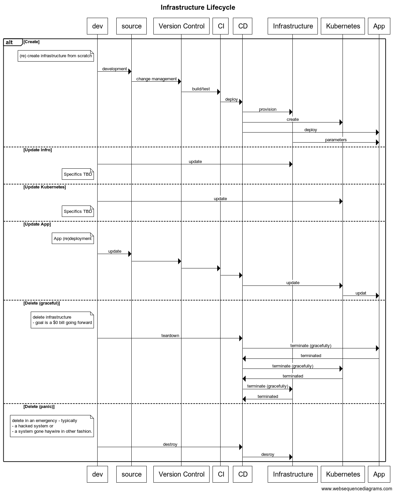

# Infrastructure Lifecycle
We are interested in an architecture that deploys an traditional 3-tiered app (ui, api, db) over
a Kubernetes cluster which itself is deployed over provisioned public cloud infrastructure. 

The goal is to build Infrastructure as Code (IaC), which allows us to treat as much of the 
infrastructure as cattle as possible. As we'll see, this is currently not a 100% certainty,
but can be assured for some use-cases within the normal flow. We want this ability to make
changes and possibly recreate the infrastructure at will 

## to git-ops or not to git-ops? That is the question.

We are not yet at the stage of maturity that we can use git-ops in our setup, however, 
we cannot escape the general structure of what git-ops mandates. We are just side-stepping
a multitude of additional tools for now. We are re-inventing the wheel here to keep it simple.

The good news is that eventually this will enable an easier path towards a git-ops flow.

We can think of our infrastructure in four layers:

1. Deployed Application - the top layer - the reason we embark on this journey.
2. Configured Infrastructure - the kubernetes layer
3. Provisioned Infrastructure - the services/infrastructure provisioned on the public cloud
4. Bootstrapping script - the script that gets it all going.

Each layer has it's a notion of a life-cycle - especially the operations
    - Create
    - Update/Recreate
    - Delete 

Each layers life-cycle operation at a layer typically impacts all layers above it - this is especially true if a delete operation is invoked. However the binding between the layers is
not formalized or explicit in current IaC structures.

This requires our orchestration scripts to maintain this notion of what is possible and
what not. This is done by scripting specific use cases.

Once the infrastructure is created, for the common case of changes to the app-code, we
have the ability to (re)deploy at will. But that is only because we do not make changes to layers 2-4 in the hierarchy described above. If something should change there, it's most likely a destructive recreation of the system.

The rest of this document tries to build the Create & Delete operations for each layer, so 
we can provide these in a scripted fashion. While not complete control, it does allow us
to treat our infrastructure as "cattle-not-pets". 

The sequence diagram below pulls together the various actors into a single inter-dependent flow
and layers on the various operations.

Note that while we indicate the notion of updates to the kubernetes cluster and the underlying infrastructure, this is currently not addressed as part of this exercise.
