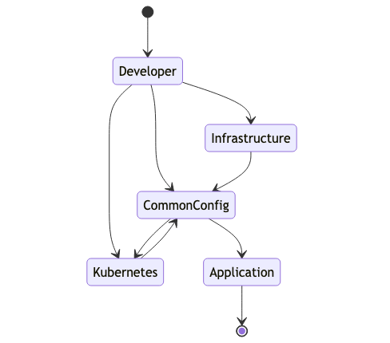
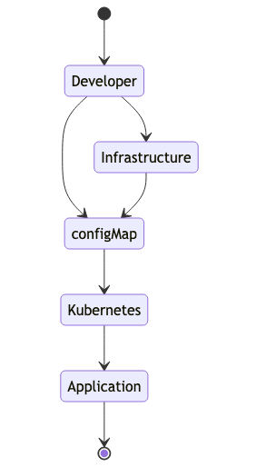

# Release flow
Between cloud infrastructure and kubernetes, the flow of application-level
config gets murky. So we need to have a clearly defined process on how an
application build, kubernetes configuration and/or infrastructure modification
is communicated to each layer, so it can serve it's role appropriately.

It is simplest to think of the application as three layers:
1. Application
2. Kubernetes
3. Infrastructure

In their simplest forms, these layers are well isolated and have clear boundaries.
However, it's also important to handle cases with a blurry boundary.

Take for example a case of replacing the DB service running within Kubernetes with 
a cloud providers managed DB service. (Our focus is on the config-propagation
problem. Hence, we'll ignore the data-preservation concerns)
This would involve: 
- Adding the managed DB to the infrastructure
- Reconfiguring (possibly restarting) the backend/api service to use the new managed DB
- Removing the old DB from the kubernetes cluster

In general, the three layers mentioned above, can be configured/modified by the developer independently, but typically configuration information can also flow
upstream - meaning the lower layers upon instantiation/effecting-change, have
config information that a higher layer likely needs. 

The data flow paths are illustrated in the following state diagram

## Kubernetes updating ConfigMap/Secrets
The point of any change/release management is to confidently update a config,
partially or completely and know that it behaves in a sensible fashion.

Applications typically need configuration information that provides
location and credentials to access other services (databases, APIs, queues, etc)
Further, not all applications are designed to be able to deal with these being
modified post launch.

Depending on whether the application can watch and react to changes in config,
the application can self heal or will need intervention from the orchestration layer.
Since we are running on Kubernetes, ideally, we'd let kubernetes do the needful.

Kubernetes uses [`configMap`](https://kubernetes.io/docs/concepts/configuration/configmap/) and [`secrets`](https://kubernetes.io/docs/concepts/configuration/secret/) 
to communicate configuration information to containers. This is however not without it's issues. Updates to either [`configMap`](https://kubernetes.io/docs/concepts/configuration/configmap/) or [`secrets`](https://kubernetes.io/docs/concepts/configuration/secret/) do not trigger an update on the underlying deployments.

Depending on whether the application can auto-respond to changes, this can be an issue. 

Both [`kustomize`](https://github.com/kubernetes-sigs/kustomize/blob/master/examples/configGeneration.md) & [`helm`](https://v2.helm.sh/docs/developing_charts/#automatically-roll-deployments-when-configmaps-or-secrets-change) provide mechanisms to deal with this. 

However, if one is NOT using these, we still have options. The two best ones:
1. We can mimick the helm strategy and update a hash annotation on the pod within the deployment config. 
2. A [simpler (and easier to implement cross-platform) way](https://stackoverflow.com/questions/37317003/restart-pods-when-configmap-updates-in-kubernetes/51421527#51421527) would be to keep a monotonically increasing configMap-hash value.
3. Use a tool like [`reloader`](https://github.com/stakater/Reloader) which triggers a run-time update. 

The current implementation of a deployment template tries to make as few hard choices as possible. 
Meaning we have shied away from `helm` or `kustomize` at this point in time. We choose to provide a simple utility script [configMapVersion.js](../bin/configMapVersion.js) that computes a monotonically increasing version value and updates the `configMapVersion` key. It uses a text based
find-and-replace strategy. This requires we use `configMapVersion` as a key, but avoids the need
for heavier dependencies like `js-yaml`.

Using configMap simplifies the config management problem to the one below:

